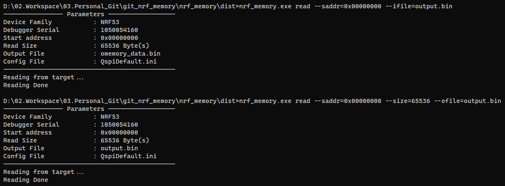
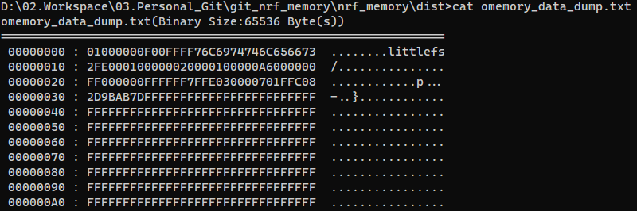
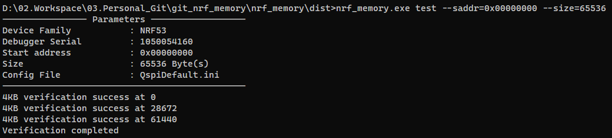
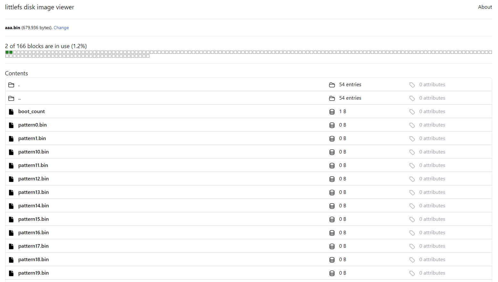

# nrf_memory ( QSPI flash control tool )


## Introduction

This tool provides the ability to write and read binary data to and from an external QSPI flash, a shortcoming of the nrfjprog.exe commonly used in the nRF5 series.

This is supporting 3 main features that reading the binary data from QSPI flash, writing the binary data to QSPI flash and verifying the reliability.


## Usage

At first , **Change the  CS/SCK/DIO pins in QspiDefault.ini**  to fit your target board.

Then use the command and options as following below description.

```shell
Usage: 
    nrf_memory COMMAND [--family=<DeviceFamily>] [--saddr=<startaddress>] [--size=<n>] [--ofile=<filename>.bin] [--ifile=<filename>.bin] [--serial=<serialno.>] [--conf=<ini_file>] [--dump=<n>] [--pattern=<pattern>] [--fulltest=<n>]
    nrf_memory (-h | --help | -v | --version)
```

#### Command & Options

```
COMMAND:
    read                 Read binary from the given QSPI's address
    write                Write binary to the given QSPI's address
    test                 Memory test
    store                Store the default ini file
    
Options:
    -h, --help           Show this screen and exit
    -v, --version        Show version
    --saddr=<n>          Start address
    --size=<n>           Reading size
    --ofile=<filename>   Output binary file name
    --ifile=<filename>   Input binary file name
    --serial=<n>         J-link serial number. If not set, listing or set automatically
    --conf=<filename>    Configuration File
    --dump=<n>           Enable/Disable hex-dump (true=enable, false=disable)
    --pattern=<pattern>  4Bytes test pattern (default:0x55555555)
    --fulltest=<n>       Test whole memory (true=enable, false=disable)
    --family=<device>    Device Family (NRF52, NRF53, NRF91). If not set, set automatically
```

####  Example

```shell
nrf_memory read --saddr=0x1200 --size=4096 --ofile=memorydata.bin --dump=1
```

```shell
nrf_memory write --saddr=0x2400 --ifile=memory.bin    
```

```shell
nrf_memory test --saddr=0x1000 --size=0x10000 --pattern=0x5A5A5A5A --fulltest=false
```

```shell
nrf_memory store
```


## Details

> - The tool will be detecting the device family automatically if you don't provide the information
> - If you don't set the J-link serial number, the tool will be listing or select the J-link automatically

**Reading out and writing the data from/to given range of QSPI flash memory**



**Dumping out the QSPI flash memory data as readable file**



**Partial QSPI Flash memory verification**




## Tips

I used this tool to analyze the stored data in littlefs.

After reading out from the QSPI flash memory, you can see the data that stored in the littlefs through [littlefs disk image viewer (tniessen.github.io)](https://tniessen.github.io/littlefs-disk-img-viewer/), as shown in the figure below.





## Limitations

- The executable file requires Window 10 or later. 
- Not yet supported intel HEX format
